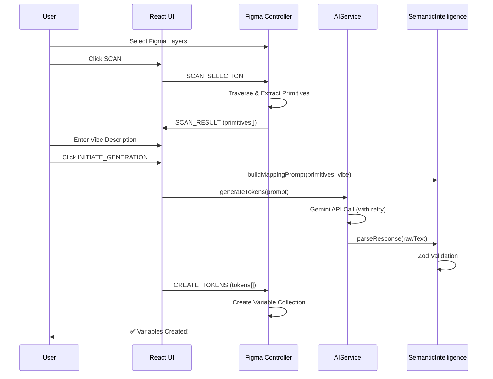

# 🎨 Vibe Tokens — AI-Powered Design System Generator

<div align="center">
  
  
  
  
  
</div>

---

## 🚀 Overview

**Vibe Tokens** is a next-generation Figma plugin that leverages Google's Gemini AI to automatically generate semantically-structured design tokens from your existing designs. Simply describe the desired "vibe" and let AI create a complete token system including colors, spacing, radius, and typography.

### ✨ Key Features

| Feature | Description |
|---------|-------------|
| **🔍 Visual Scanner** | Automatically extracts colors and border-radius from selected Figma layers |
| **🧠 AI Token Generation** | Uses Gemini 2.5 Flash to generate semantic token mappings based on your vibe description |
| **📦 Native Figma Variables** | Creates real Figma Variable Collections directly in your file |
| **🔒 Secure Storage** | API keys are encrypted and stored locally using Figma's `clientStorage` |
| **⚡ Retry Logic** | Built-in exponential backoff for handling API rate limits (429/503) |
| **🛡️ Zod Validation** | Strict schema validation prevents malformed AI responses |

---

## 📐 Architecture

The plugin follows **Clean Architecture** principles:

```
src/
├── controller.ts          # Figma Plugin Sandbox (Main Thread)
├── App.tsx                # React UI Entry Point
├── logic/                 # 🧠 DOMAIN LAYER (Business Logic)
│   ├── AIService.ts       # Gemini API Integration + Retry
│   ├── SemanticIntelligence.ts  # Prompt Engineering + Parsing
│   └── ColorUtils.ts      # Color Manipulation (colord)
├── ui/                    # 🎨 PRESENTATION LAYER
│   ├── theme.css          # Glassmorphism Design System
│   ├── components/
│   │   └── ErrorConsole.tsx  # Debug Console UI
│   └── hooks/
│       └── usePersistentState.ts  # API Key Persistence Hook
└── infra/                 # 🔌 INFRASTRUCTURE LAYER
    └── SettingsService.ts # Figma clientStorage Adapter
```

### Data Flow



---

## 🛠️ Installation

### Prerequisites

- Node.js 18+
- Figma Desktop App
- Google Gemini API Key ([Get one here](https://aistudio.google.com/app/apikey))

### Setup

```bash
# Clone repository
git clone https://github.com/your-org/vibe-plugin.git
cd vibe-plugin/vibe-plugin

# Install dependencies
npm install

# Start development server
npm run dev

# Build for production
npm run build
```

### Load in Figma

1. Open Figma Desktop
2. Go to **Plugins → Development → Import plugin from manifest...**
3. Select `vibe-plugin/vibe-plugin/manifest.json`
4. Run from **Plugins → Development → Vibe Tokens**

---

## 🎮 Usage

### Quick Start

1. **Configure API Key**: Paste your Gemini API key in the `SECURE_KEY_STORAGE` field
2. **Select Layers**: Select frames or shapes in your Figma file
3. **Scan**: Click `SCAN` to extract design primitives (colors, radius)
4. **Describe Vibe**: Enter a description like *"Cyberpunk Neon"* or *"Soft Pastel SaaS"*
5. **Generate**: Click `INITIATE_GENERATION` to create tokens
6. **Verify**: Check Figma's Local Variables panel for your new collection

### Token Types Generated

| Type | Example | Figma Variable Type |
|------|---------|---------------------|
| `color` | `#6366F1` | COLOR |
| `spacing` | `16` | FLOAT |
| `borderRadius` | `8` | FLOAT |
| `fontFamily` | `"Inter"` | STRING |

---

## 🧪 Development

### Scripts

```bash
npm run dev      # Start Vite dev server
npm run build    # Build UI + Controller bundle
npm run preview  # Preview production build
```

### Tech Stack

| Technology | Purpose |
|------------|---------|
| **Vite 7** | Build tool & dev server |
| **React 19** | UI framework |
| **TypeScript 5.9** | Type safety |
| **@google/generative-ai** | Gemini API SDK |
| **zod 4** | Runtime validation |
| **colord** | Color manipulation |
| **esbuild** | Controller bundling |

---

## 🔧 Configuration

### Environment Variables

The plugin uses Figma's secure `clientStorage` for API key persistence. No `.env` file is required for the plugin itself.

### Manifest Configuration

```json
{
  "name": "Vibe Tokens",
  "id": "vibe-tokens-plugin",
  "api": "1.0.0",
  "main": "dist/controller.js",
  "ui": "dist/index.html",
  "editorType": ["figma"]
}
```

---

## 🛡️ Error Handling

The plugin includes robust error handling:

- **AI Failures**: Exponential backoff retry (1s → 2s → 4s)
- **Invalid JSON**: Surgical extraction of JSON arrays from AI responses
- **Schema Violations**: Zod validation with detailed error messages
- **User Errors**: Visual "System Critical Failure" console with copy-to-clipboard

---

## 📜 License

MIT © 2026 Vibe Studio

---

## 🤝 Contributing

1. Fork the repository
2. Create a feature branch (`git checkout -b feature/amazing-feature`)
3. Commit changes (`git commit -m 'Add amazing feature'`)
4. Push to branch (`git push origin feature/amazing-feature`)
5. Open a Pull Request

---

<div align="center">
  <strong>Built with 💜 for the Design Systems Community</strong>
</div>
