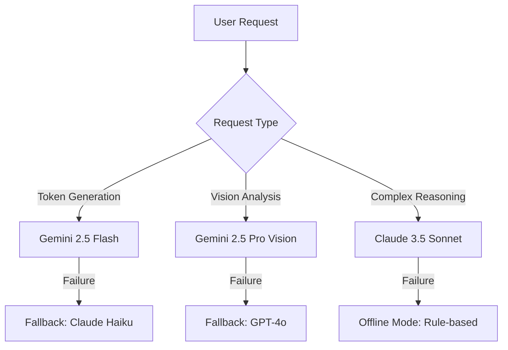

# 📦 Vibe Tokens v3.0 — Product Requirements Document (PRD)

> **Document Version:** 1.0  
> **Author:** Vibe Studio Product Team  
> **Last Updated:** 2026-01-20  
> **Status:** 🔵 Draft — Pending Stakeholder Review

---

## 1. Executive Summary

**Vibe Tokens v3.0** represents a major intelligence upgrade focusing on autonomous design analysis, multi-modal AI capabilities, and enterprise-grade features. This release transforms the plugin from a simple token generator into an **Intelligent Design System Architect**.

### Vision Statement

> "From a passive utility to an **Active Design Co-Founder**. Vibe Tokens v3.0 doesn't just waiting for commands—it proactively audits, architects, and safeguards your design system using autonomous agentic loops and self-healing logic."

---

## 2. Current State Analysis (v2.2)

### Existing Capabilities
- ✅ Manual layer selection scanning
- ✅ Color and border-radius extraction
- ✅ Basic vibe-based token generation
- ✅ Single Gemini API model integration
- ✅ Local API key storage

### Identified Limitations
| Gap | Impact |
|-----|--------|
| Manual selection required | Slows workflow |
| No typography extraction | Incomplete tokens |
| Single AI model dependency | Limited fallback |
| No design history analysis | Context-less suggestions |
| No accessibility checking | Compliance risks |
| No collaboration features | Team friction |

---

## 3. Proposed Intelligent Features (v3.0)

### 3.1 🧠 Autonomous Design Intelligence

#### Feature: Auto-Discovery Engine

**Description:** Automatically scan entire pages/documents to discover, catalog, and deduplicate design primitives without manual selection.

**Technical Approach:**
```typescript
interface AutoDiscovery {
  scope: 'selection' | 'page' | 'document';
  filters: {
    includeHidden: boolean;
    minUsageCount: number;  // Only surface patterns used 3+ times
    deduplicationRadius: number;  // Color similarity threshold (ΔE)
  };
  output: {
    colors: ColorCluster[];
    typography: TypographyPattern[];
    spacing: SpacingScale[];
    effects: ShadowPattern[];
  };
}
```

**User Benefit:** 10x faster design analysis. Zero missed tokens.

---

#### Feature: Intent Recognition AI

**Description:** Analyze component structures to understand semantic meaning (e.g., "this looks like a CTA button") and auto-suggest token names.

**Intelligence Layer:**
| Input | AI Analysis | Suggested Token |
|-------|-------------|-----------------|
| Large bold text + small subtext | "Heading pattern" | `typography.heading.xl` |
| Rounded rectangle + icon + text | "Button pattern" | `component.button.primary` |
| Low contrast background | "Surface pattern" | `color.surface.muted` |

**Technical Implementation:**
- Multi-modal vision model (Gemini 2.5 Vision)
- Component structure heuristics
- Design pattern database matching

---

### 3.2 🎨 Advanced Token Types

#### Feature: Complete Token Extraction

| Token Type | Current | v3.0 |
|------------|---------|------|
| Colors | ✅ Yes | ✅ Enhanced clustering |
| Border Radius | ✅ Yes | ✅ Multi-corner support |
| Typography | ❌ No | ✅ Full type scale extraction |
| Shadows | ❌ No | ✅ Box shadow tokens |
| Spacing | ❌ Partial | ✅ Auto-grid inference |
| Gradients | ❌ No | ✅ Gradient tokens |
| Motion | ❌ No | ✅ Animation tokens |

**Typography Schema:**
```typescript
interface TypographyToken {
  name: string;
  $value: {
    fontFamily: string;
    fontWeight: number;
    fontSize: number;
    lineHeight: number | string;
    letterSpacing: number;
  };
  $type: 'typography';
}
```

---

### 3.3 ♿ Accessibility Intelligence

#### Feature: WCAG Compliance Analyzer

**Description:** Automatically analyze color combinations and flag accessibility issues before token creation.

**Checks:**
| Check | Standard | Action |
|-------|----------|--------|
| Color Contrast | WCAG AA (4.5:1) | ⚠️ Warning if failed |
| Color Contrast (Large Text) | WCAG AA (3:1) | ⚠️ Warning if failed |
| Color Blindness Simulation | Protanopia, Deuteranopia | 🔍 Visual preview |

**AI Enhancement:** Suggest accessible color alternatives that maintain the original vibe aesthetic.

```typescript
interface AccessibilityReport {
  overallScore: 'AAA' | 'AA' | 'A' | 'FAIL';
  issues: {
    tokenPair: [string, string];
    contrastRatio: number;
    requiredRatio: number;
    suggestions: string[];  // AI-generated alternatives
  }[];
}
```

---

### 3.4 🔄 Multi-Model AI Architecture

#### Feature: Resilient AI Backend

**Description:** Support multiple AI providers with automatic fallback and specialized model routing.

**Architecture:**


**Configuration:**
```typescript
interface AIConfig {
  primary: {
    provider: 'gemini' | 'anthropic' | 'openai';
    model: string;
    apiKey: string;
  };
  fallback: AIConfig['primary'][];
  routing: {
    tokenGeneration: ModelRoute;
    visionAnalysis: ModelRoute;
    accessibilityCheck: ModelRoute;
  };
}
```

---

### 3.5 📚 Design History & Learning

#### Feature: Project Memory

**Description:** Remember design decisions across sessions and learn from user feedback to improve suggestions.

**Capabilities:**
- Store approved token mappings per project
- Learn naming conventions from corrections
- Suggest consistent tokens for new components
- Surface unused tokens for cleanup

**Data Model:**
```typescript
interface ProjectMemory {
  projectId: string;
  tokenHistory: TokenDecision[];
  namingPatterns: {
    prefix: string;
    category: string;
    examples: string[];
  }[];
  vibePreferences: {
    preferredColors: string[];
    rejectedColors: string[];
    styleKeywords: string[];
  };
}
```

---

### 3.7 🏗️ System Architecture v3.0 (The Agentic Core)

#### Feature: Distributed Intelligence Layer

**Description:** Moving from a simple request/response model to a stateful Agentic architecture that maintains context and "thinks" before acting.

**Architecture Diagram:**

```mermaid
graph TD
    UserInput --> AgentCore[⚡ Agent Core]
    AgentCore --> Memory[📚 Project Memory (Vector DB)]
    AgentCore --> Perception[👁️ Design Perception Engine]
    
    subgraph "The Brain (Deep Compute)"
        Perception --> |Raw Nodes| PatternMatch[Pattern Recognition]
        PatternMatch --> |Heuristics| IntentNet[Intent Classification]
        IntentNet --> |Semantic Plan| Strategy[Generation Strategy]
    end
    
    Strategy --> Executor[🛠️ Token Executor]
    Executor --> QualityGate{🛡️ Quality Gates}
    
    QualityGate --> |Pass| Figma[Figma Document]
    QualityGate --> |Fail (e.g. WCAG)| SelfHeal[🚑 Self-Healing Loop]
    SelfHeal --> Strategy
```

**Key Components:**
- **Perception Engine:** Real-time DOM observer for Figma nodes.
- **Self-Healing Loop:** Automatic recursion when tokens fail validation (e.g., contrast ratio < 4.5).
- **Vector Memory:** RAG-based retrieval of past design decisions.

---

### 3.8 🛡️ Self-Healing & Quality Gates

#### Feature: Autonomous Correction

**Description:** The plugin doesn't just "error out" on bad generation; it actively fixes it using a "System 2" thinking loop.

**Logic Flow:**
1. **Generate** candidate tokens.
2. **Simulate** application (Contrast check, Collision check).
3. **Critique** results against constraints (WCAG AA, Naming Conventions).
4. **Refine** candidates if constraints are violated.
5. **Commit** only when Quality Gates are passed.

**Protocol:**
> "If the AI generates a button color that fails contrast, it AUTOMATICALLY adjusts lightness (L value) until it passes, logging the intervention."

---

### 3.9 🕵️ Agentic Design Ops (The Watchdog)

#### Feature: Proactive Deviation Alerting

**Description:** The plugin runs silently in the background, monitoring design actions to ensure token adherence.

**Capabilities:**
- **Detachment Alert:** "You just detached a `primary.button` instance. Re-attach?"
- **Ghost Value Spotter:** "You used `#6366F1` usage manually. That matches `primary.600`. Apply token?"
- **Inconsistency Warn:** "This frame uses mixed radius (4px and 6px). Standardize to `radius.sm`?"

---

### 3.10 🤝 Collaboration Features

#### Feature: Team Token Library

**Description:** Sync generated tokens to a shared team library with version control.

| Capability | Description |
|------------|-------------|
| Cloud Sync | Push/pull tokens to shared storage |
| Conflict Resolution | Visual diff for token collisions |
| Approval Workflow | Token changes require team leads approval |
| Change Log | Audit trail for all modifications |

---

### 3.7 📤 Export & Integration

#### Feature: Universal Export Engine

**Description:** Export tokens in multiple formats for cross-platform design systems.

**Supported Formats:**
| Format | Use Case |
|--------|----------|
| W3C DTCG JSON | Standard design token format |
| CSS Variables | Web development |
| Tailwind Config | Tailwind CSS projects |
| Style Dictionary | Token transformation pipelines |
| Swift/Kotlin | Native mobile development |
| Tokens Studio JSON | Figma Tokens interop |

---

## 4. Technical Requirements

### Performance Targets
| Metric | Target |
|--------|--------|
| Page scan (<100 nodes) | < 2 seconds |
| Page scan (<1000 nodes) | < 10 seconds |
| AI response time | < 8 seconds avg |
| Memory usage | < 50MB |

### Security Requirements
- API keys encrypted at rest (AES-256)
- No data transmission to third parties beyond AI providers
- Optional on-premise AI deployment for enterprise
- SOC 2 Type II compliance roadmap

---

## 5. User Experience Enhancements

### Redesigned UI Features

| Component | Enhancement |
|-----------|-------------|
| Scanner Panel | Progress indicator with node count |
| AI Status | Streaming response preview |
| Token Preview | Visual swatches inline |
| Error Console | Contextual help links |
| Settings | Tabbed configuration screen |

### Keyboard Shortcuts

| Shortcut | Action |
|----------|--------|
| `Ctrl+Shift+S` | Quick scan selection |
| `Ctrl+Shift+G` | Generate with last vibe |
| `Ctrl+Shift+E` | Export tokens |

---

## 6. Rollout Plan

### Phase 1: Foundation (Q1 2026)
- [ ] Typography extraction
- [ ] Shadow token support
- [ ] Multi-model fallback

### Phase 2: Intelligence (Q2 2026)
- [ ] Auto-discovery engine
- [ ] Intent recognition AI
- [ ] Accessibility analyzer

### Phase 3: Collaboration (Q3 2026)
- [ ] Team library sync
- [ ] Approval workflows
- [ ] Universal export

### Phase 4: Enterprise (Q4 2026)
- [ ] On-premise AI deployment
- [ ] SSO integration
- [ ] Usage analytics dashboard

---

## 7. Success Metrics

| KPI | Current | Target (v3.0) |
|-----|---------|---------------|
| Tokens generated per session | ~12 | 50+ |
| Time to first token | 45 sec | 15 sec |
| AI suggestion acceptance rate | — | 80%+ |
| WCAG compliance detection rate | 0% | 95%+ |
| Weekly active teams | — | 100+ |

---

## 8. Risks & Mitigations

| Risk | Likelihood | Impact | Mitigation |
|------|------------|--------|------------|
| AI model deprecation | Medium | High | Multi-provider architecture |
| Performance on large files | High | Medium | Pagination, background processing |
| API cost overrun | Medium | Medium | Usage quotas, caching |
| Feature scope creep | High | Medium | Phased rollout with gates |

---

## 9. Open Questions

1. Should we support Figma Dev Mode integration for code-ready tokens?
2. What's the pricing model for team collaboration features?
3. Do we need offline mode for enterprise customers?

---

## 10. Approval Signatures

| Role | Name | Date | Status |
|------|------|------|--------|
| Product Owner | — | — | ⏳ Pending |
| Engineering Lead | — | — | ⏳ Pending |
| Design Lead | — | — | ⏳ Pending |
| Security Review | — | — | ⏳ Pending |

---

**Document ID:** PRD-VIBE-V3-2026  
**Classification:** Internal
